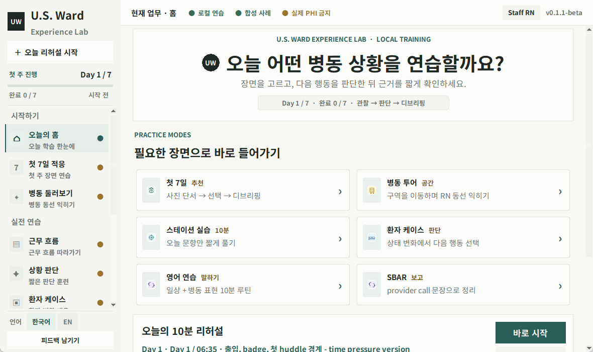
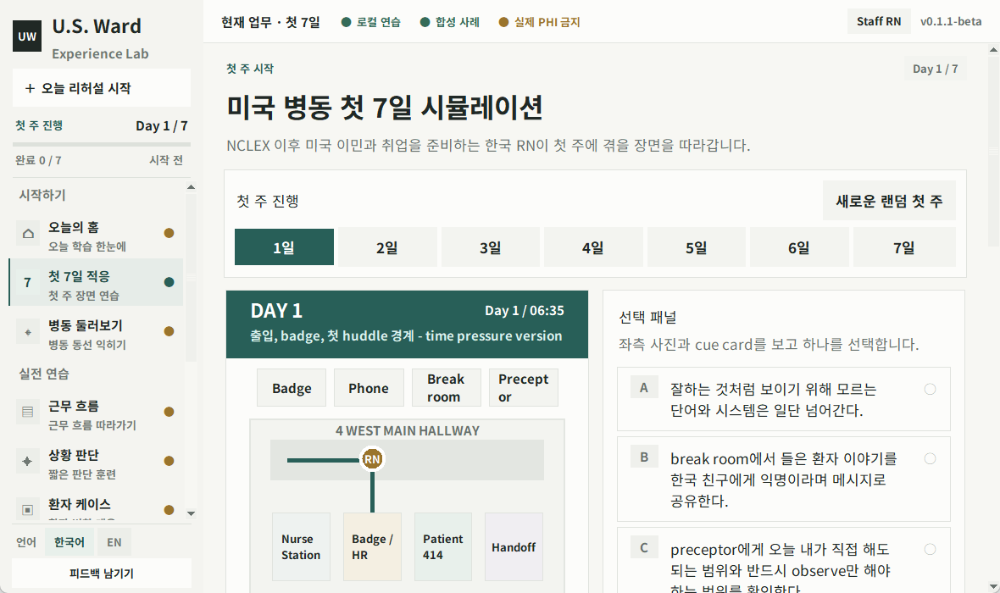
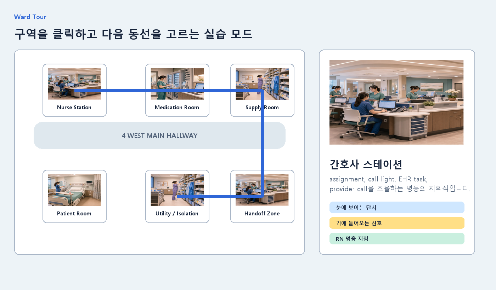

# U.S. Ward Experience Lab

U.S. Ward Experience Lab is a beta educational simulation for Korean RNs preparing for U.S. hospital work experience.

이 프로그램은 미국 이민/취업을 준비하는 한국 RN이 미국 병동의 업무 흐름을 간접 체험할 수 있도록 만든 Windows 데스크톱 교육용 시뮬레이션입니다.

## Who is this for?

- NCLEX 준비 중인 한국 간호사
- NCLEX 합격 후 미국 취업/이민을 준비하는 RN
- 미국 병동 workflow를 미리 체험하고 싶은 한국 RN
- 미국 병원에서의 EHR, MAR, handoff, provider call, delegation, privacy 문화가 궁금한 사용자

## Main Features

- First 7 Days simulation
- Ward Tour
- Station Practice
- Patient Cases
- SBAR practice
- Job Tracks
- Korean/English support
- Short beta feedback button
- Bundled Noto Sans KR font for more consistent Korean UI rendering
- Refreshed interface with clearer navigation and layouts, including smaller window sizes
- Practice progress and draft persistence for supported exercises

## Download

Latest Windows beta:

[Download USWardExperienceLab_v0.1.1-beta.exe](https://github.com/PowerMachine/us-ward-experience-lab/releases/download/v0.1.1-beta/USWardExperienceLab_v0.1.1-beta.exe)

Public builds are attached on the GitHub Releases page.

GitHub Pages landing page:

```text
https://PowerMachine.github.io/us-ward-experience-lab
```

Windows SmartScreen warning may appear because this is an unsigned beta executable.

## macOS Experimental Build

macOS builds are experimental and unsigned.

This repository includes a GitHub Actions workflow that builds an unsigned `USWardExperienceLab.app` zip on a macOS runner:

```text
.github/workflows/build-macos.yml
```

Apple Developer Program membership is not required for this experimental build, but macOS Gatekeeper may show an "unidentified developer" warning because the app is not signed or notarized.

The macOS workflow produces an unsigned experimental artifact. It is not part of the Windows v0.1.1-beta release and has not been verified for this update.

## Important Notice

This program is an independent educational simulation.

It is not an official NCLEX preparation product.

It is not affiliated with NCSBN, NCLEX, any hospital, or any healthcare institution.

This program does not provide medical advice, diagnosis, treatment, clinical judgment, legal advice, immigration advice, employment advice, or facility policy guidance.

Do not enter real patient information or personally identifiable information.

실제 환자 이름, 병원명, 생년월일, MRN, 전화번호, 주소, 검사결과, 사진 등 식별 가능한 정보는 입력하지 마세요.

## Font Notice

This project bundles Noto Sans KR from Google Fonts under the SIL Open Font License 1.1 for consistent Korean UI rendering.

See [THIRD_PARTY_NOTICES.md](THIRD_PARTY_NOTICES.md).

## Feedback

This is a beta version. Short feedback is very helpful.

Feedback Form:

```text
https://docs.google.com/forms/d/e/1FAIpQLScUc4cvKVPYf1DdItAYW74V8bXQidAS9CHh7d5akhNyv2Oe5w/viewform?usp=publish-editor
```

Please keep feedback simple:

- What was useful?
- What felt unrealistic?
- What scenario should be added?
- Did any error occur?

Do not include real patient information.

## Screenshots

Actual Windows v0.1.1-beta app screens (home, first-week simulation, and ward tour):






